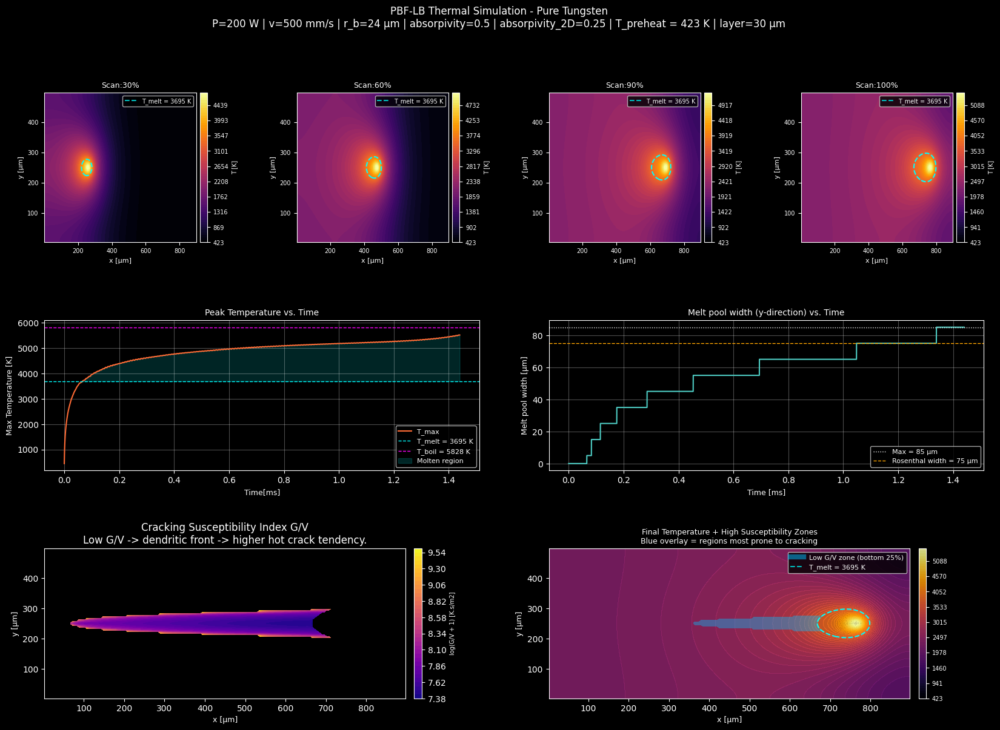

# tungsten-pbflb-sim
# Thermal Simulation of PBF-LB on Pure Tungsten
### Modeling and Identification of Crack-Risk Areas
 
The simulation is contained in the file model.ipynb. 
A 2D finite-difference thermal model of a single laser scan track during
Laser Powder Bed Fusion (PBF-LB) of pure tungsten, with a spatially-resolved
cracking susceptibility index based on the G/V ratio at the solidification front.
 
Developed as part of a technical portfolio on the topic of additive manufacturing of refractory metals for nuclear fusion
applications.

---

## Background
 
Tungsten is the primary candidate material for plasma-facing components
(divertor monoblocks) in nuclear fusion reactors such as ITER and DEMO,
due to its extremely high melting point (3422°C), low tritium retention,
and high thermal conductivity. However, processing tungsten via PBF-LB
presents a critical challenge: microcracks and macrocracks form during
the build process, rendering printed parts structurally unviable.
 
This model investigates the thermal history of the material during a single
laser scan track and maps the G/V ratio — the ratio of the temperature
gradient to the solidification front velocity — as a proxy for cracking
susceptibility at the solidification front.
 
The full description of the model, assumptions, and results is available in
the accompanying report:
*"Thermal simulation of PBF-LB on pure tungsten: modeling and identification
of crack-risk areas"* — S. Rizzo, 2025.
 
---
 
## Model Description
 
The model solves the 2D plan-view heat equation with a moving Gaussian
laser source using the Finite Difference Method:
 
```
rho * cp_eff * dT/dt = k * nabla²T + Q / h_layer
```
 
Where:
- `cp_eff` includes an additional contribute in the mushy zone
- `Q` is the Gaussian surface heat flux from the laser beam
- `h_layer` is the powder layer thickness

### Key assumptions
 
- 2D plan-view domain (x-y plane)
- Material properties (k, cp, rho) are constant with temperature
- No fluid dynamics in the melt pool 
- Neumann (zero-flux) boundary conditions on all edges
- The G/V cracking index is a qualitative proxy

### Process parameters
 
From literature, Sharma et al. (2025)
 
| Parameter         | Value       |
|-------------------|-------------|
| Laser power P     | 200 W       |
| Scan speed v      | 500 mm/s    |
| Beam radius r_b   | 23.5 µm     |
| Layer thickness   | 30 µm       |
| Absorptivity η    | 0.50        |
| Preheat temp T₀   | 423 K       |
 
### Material properties — Pure Tungsten
 
| Property                  | Value                  |
|---------------------------|------------------------|
| Density ρ                 | 19 250 kg/m³           |
| Specific heat cp          | 134 J/(kg·K)           |
| Thermal conductivity k    | 174 W/(m·K)            |
| Melting temperature       | 3695 K  (3422°C)       |
| Boiling temperature       | 5828 K  (5555°C)       |
| Latent heat of fusion     | 284 000 J/kg           |
 
---
 
## Code Structure
 
The simulation is divided into five independent blocks.
```
block_01         →  Physical parameters + numerical setup
 
block_02         →  Numerical functions + unit tests
                           (cp_effective, gaussian_source,
                            laplacian_2d, neumann_bc)
 
block_03         →  Explicit finite-difference time loop
                    G/V accumulation at the solidification front
 
block_04         →  G/V averaging and normalisation
                    Cracking susceptibility index computation
 
block_05         →  Final figure (temperature snapshots,
                    melt pool width, G/V map, crack-risk overlay)
                    Output: output.png
```
 
---
## How to Run
 
Clone the repository and install dependencies:
 
```bash
git clone https://github.com/lusimu24/tungsten-pbflb-sim.git
cd tungsten-pbflb-sim
pip install -r requirements.txt
```
 
Run the blocks in sequence.

---

## Output
 
The final figure (`output.png`) contains six panels:
 
- **Row 1**: Temperature field snapshots at 30%, 60%, 90%, 100% of scan.
  Cyan dashed line = melt pool boundary (T = T_melt).
- **Row 2 left**: Peak temperature vs. time.
- **Row 2 right**: Melt pool width (y-direction) vs. time.
- **Row 3 left**: Spatially-resolved G/V cracking susceptibility index (log scale).
- **Row 3 right**: Final temperature field with low-G/V crack-risk zones overlaid.

 
---
 
## References

- Shashank Sharma, K. V. Mani Krishna, Sameehan S. Joshi, M. Radhakrishnan, Selvamu-
rugan Palaniappan, Saikumar Dussa, Rajarshi Banerjee, and Narendra B. Dahotre. Laser
based additive manufacturing of tungsten: Multi-scale thermo-kinetic and thermo-mechanical
computational model and experiments. Acta Materialia, 259:119244, 2023. ISSN 1359-6454.
doi: https://doi.org/10.1016/j.actamat.2023.119244.
- Mahmoud S. Seyam, Philip Koshy, and Mohamed A. Elbestawi. Laser powder bed fusion of
unalloyed tungsten: A review of process, structure, and properties relationships. Metals, 12(2), 2022. ISSN 2075-4701. doi: 10.3390/met12020274

---
 
## Author
 
Simone Rizzo — Materials Engineer, Politecnico di Milano (LM53, 2025)
simrizz00@gmail.com
